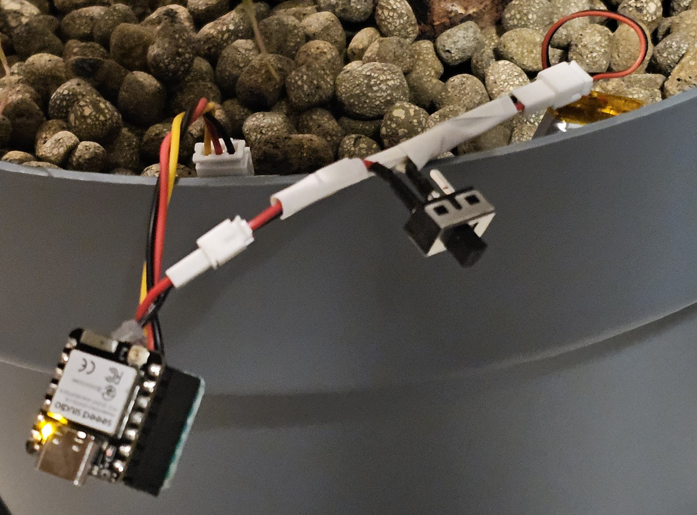
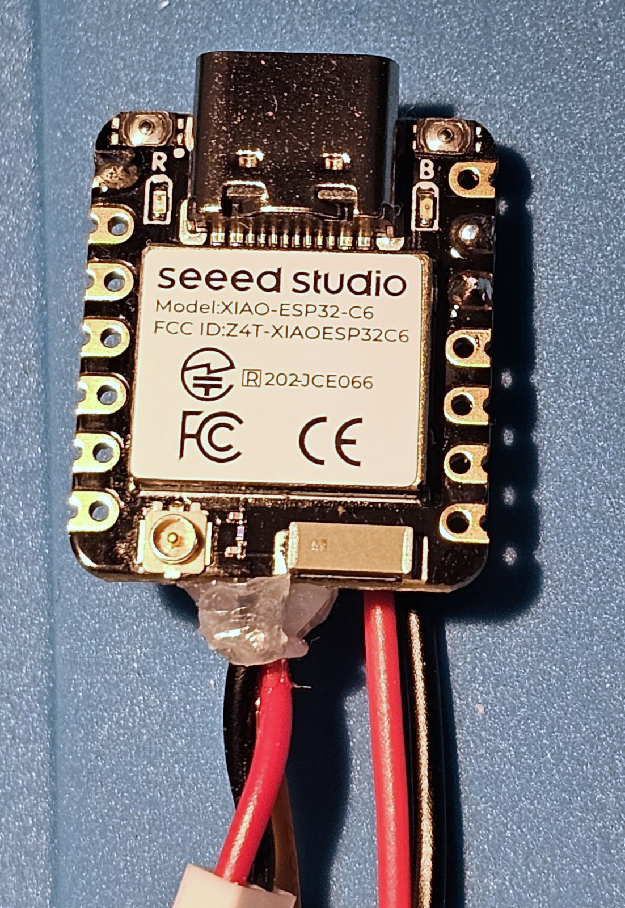
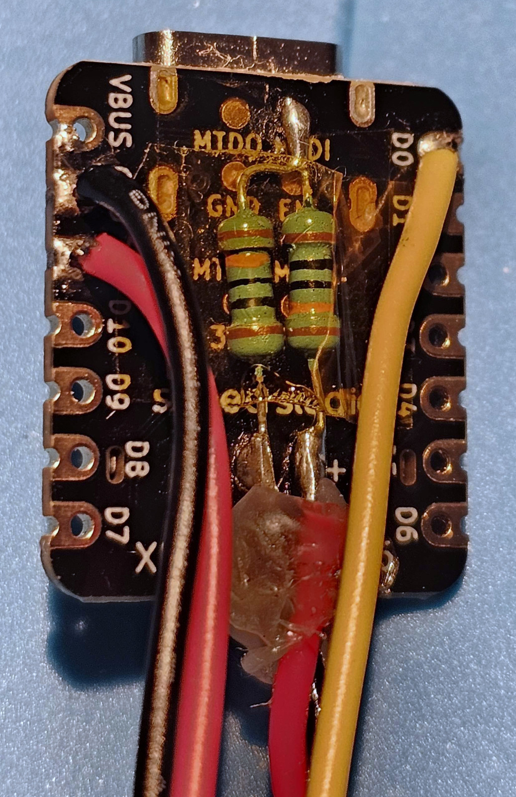
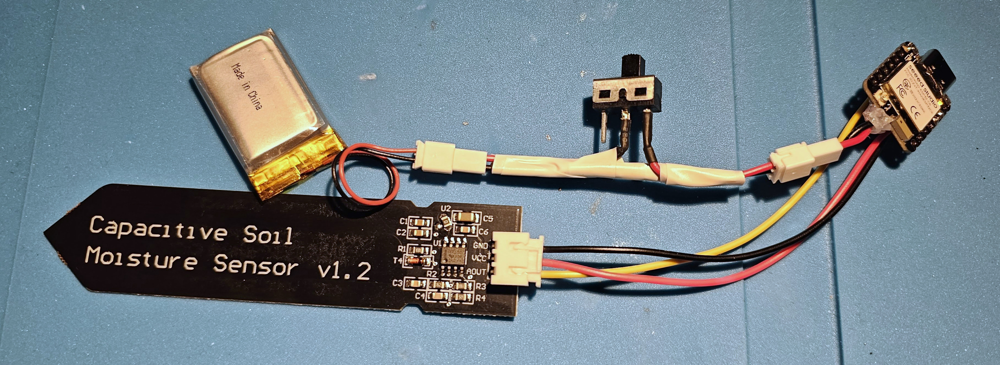
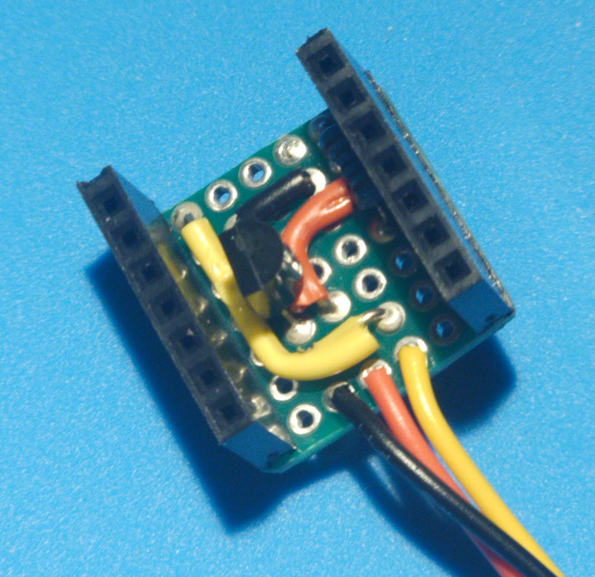

# Soil Hygrometer
Zigbee soil hygrometer with an ESP32-C6

This is an Arduino IDE sketch.
It uses an ESP32-C6 to transmit the soil humidity reading
through Zigbee. It can be integrated into Home Assistant.

## Hardware requirements

* [Seed Studio XIAO-ESP32-C6](https://wiki.seeedstudio.com/xiao_esp32c6_getting_started/)
* Soil Moisture Sensor Hygrometer Module V1.2
* A lithium ion battery
* N-MOSFET 2N7000
* 10kohm resistor

The hygrometer sensor is wired to the analog port A0.
A resistive divider is connected between the two poles of the battery.
The middle point is then connected to the analog port A5 to measure
the voltage og the battery.

The MOSFET and the resistor are optional, but they increase the battery life
by a lot. The moisture sensor is supposed to always stay connected to the
power pins, draining power even when the ESP32 is in deep sleep.
The MOSFET disables the power to the sensor when the ESP doesn't need to read
its value. The 10kohm resistor is used as pull down resitor for the gate
of the MOSFET.

Some empirical tests showed that the moisture sensor draws about 6mA,
sufficient to completely discarge a 350mAh battery in 38 hours.
Measurements with the MOSFET are still ongoing...

## Software tweaks

The hygrometer sensor measures the variation of the reactance between
the plates of the capacitor. You should review the values read when
the sensor is dry and when it's immerged in water. The values are defined
as the variables `air_value` and `water_value`.

The Arduino IDE should be configured with these parameters:
* Board: XIAO_ESP32C6
* Erase All Flash Before Sketch Update: Enabled
* Partition Scheme: Zigbee 4MB with spiff
* Zigbee Mode: Zigbee ED (end device)

Note that erasing the memory is necessary the first time to change the partition
scheme. Every time this option is active, it will erase the Zigbee configuration.
It means that the device will forget the network it was previously connected to.
You may want to disable the option after the first upload of the firmware.

Optionally, these options can be set:
* USB CDC On Boot: Enabled
* Core Debug Level: Debug

USB CDC allows to have serial-over-usb. Some prints are made during the execution of
the code. If this option is active, they will be sent to the UART interface.
The prints are done through the ESP SDK logging system, which allows to distinguish
various levels of verbosity. In order to see all prints from the code, you should enable
the Debug level. Info level is also fine, some prints will be omitted.

Note that the two optional flags may increase the power consumption. They should not be
active if you intend to run the device on battery for long period of time.

The ESP will go in deep sleep mode after gettings the reads from the sensors and sending
them via Zigbee. The time of the sleep is defined by the define `SLEEP_TIME`.

Since it's difficult to debug if the ESP goes into deep sleep, the variable `NO_SLEEP` can
be used to opt for a busy wait instead of a deep sleep.

## Usage

The yellow LED has different blinking patterns depending of the phase of the code being
executed.

* **Steady on**: in general it indicates that the device is woken up.
* **Slow blink** (0.5Hz): after the first power up, the code is letting the Zigbee
  coordinator to complete the discovery.
* **Medium blink** (5Hz): the device is establishing the connection with the Zigbee
  coordinator.
* **Fast blink** (10Hz): you are pressing down the BOOT button, after 3 seconds the
  device will perform a factory reset.

**Factory reset**
After the first power up, press and hold for 3 seconds the BOOT button while the LED is
steady on. The device will forget the last paired network and enter discovery mode.
